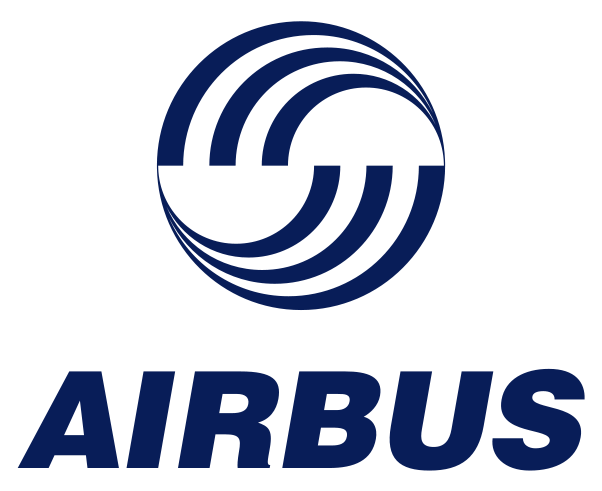

# Applications I've worked on (no particular order)

<table>
  <tr>
    <td></td>
    <td>
**Autonomous glider control and planning** 
RL 
Student: Erwan Lecarpentier (2020) 
 
    </td>
  </tr>
  <tr>
    <td></td>
    <td>
**Autonomous boat control and planning** 
RL 
Students: Paul Barde, Tristan Karch (2019) 
 
    </td>
  </tr>
  <tr>
    <td></td>
    <td>
**Earth observation satelite scheduling** 
OR and RL 
Students: Timothée Jammot (2024), Mehdi Zouitine (ongoing) 

    </td>
  </tr>
  <tr>
    <td></td>
    <td>
**Telecommunication routing in satellite constellations** 
OR 
Student: François Lamothe (2021) 
 
    </td>
  </tr>
  <tr>
    <td></td>
    <td>
**Power network scheduling** 
OR and RL 
Student: Paul Strang (ongoing) 
 
    </td>
  </tr>
  <tr>
    <td></td>
    <td>
Autopilot testing 
RL 
Student: Paul-Antoine Le Tolguenec (ongoing) 

    </td>
  </tr>
  <tr>
    <td></td>
    <td>
Aircraft Landing schedules 
OR and RL 
Student: Sana Ikli (2021) 

    </td>
  </tr>
  <tr>
    <td></td>
    <td>
Aircraft structural load forecasting 
ML 
Student: Ankit Chiplunkar (2017) 

    </td>
  </tr>
  <tr>
    <td></td>
    <td>
Robotic navigation 
RL 
Student: Hedwin Bonnavaud (ongoing) 

    </td>
  </tr>
  <tr>
    <td></td>
    <td>
Cancer treatment 
RL 
Student: Alexandre Bertin (ongoing) 

    </td>
  </tr>
  <tr>
    <td></td>
    <td>
Fluid flow control 
RL 
Students: Sandrine Berger (2023), Brice Martin (ongoing) 

    </td>
  </tr>
</table>
