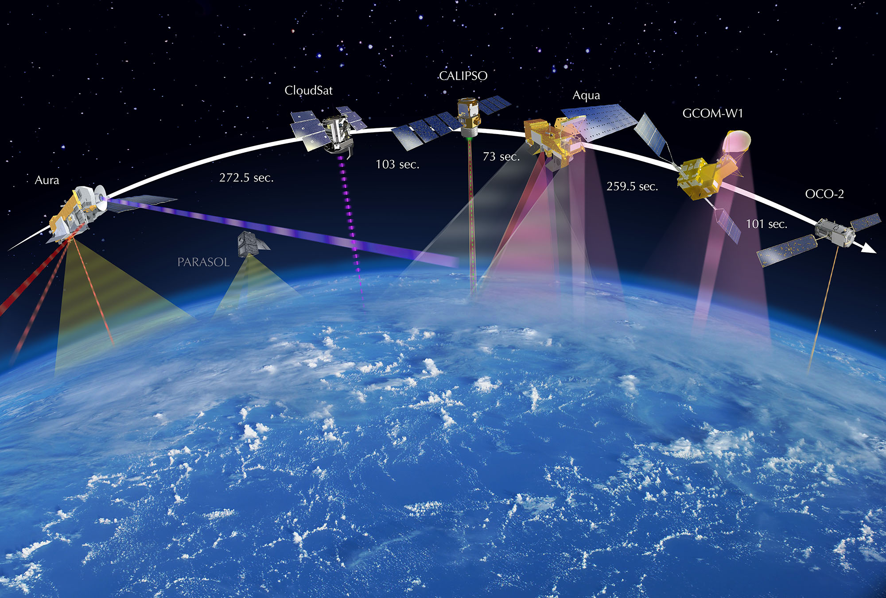
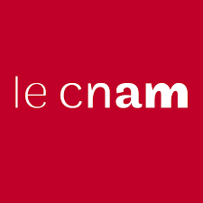
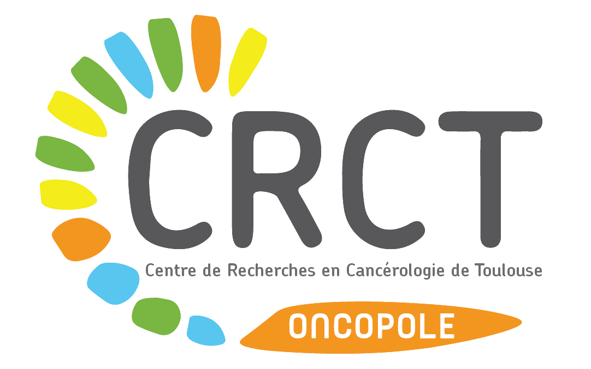

# Applications I've worked on (no particular order)

<table>
  <tr>
    <td style="text-align: center;"></td>
    <td>
<b>Autonomous glider control and planning</b> 
RL 
Student: Erwan Lecarpentier (2020) 
 
    </td>
  </tr>
  <tr>
    <td style="text-align: center;"></td>
    <td>
<b>Autonomous boat control and planning</b> 
RL 
Students: Paul Barde, Tristan Karch (2018) 

    </td>
  </tr>
  <tr>
    <td style="text-align: center;"></td>
    <td>
<b>Earth observation satelite scheduling</b> 
OR and RL 
Students: Timothée Jammot (2024), Mehdi Zouitine (ongoing) 

    </td>
  </tr>
  <tr>
    <td style="text-align: center;"></td>
    <td>
<b>Telecommunication routing in satellite constellations</b> 
OR 
Student: François Lamothe (2021) 
 
    </td>
  </tr>
  <tr>
    <td style="text-align: center;"></td>
    <td>
<b>Power network scheduling</b> 
OR and RL 
Student: Paul Strang (ongoing) 
 
    </td>
  </tr>
  <tr>
    <td style="text-align: center;"></td>
    <td>
<b>Autopilot stress testing</b> 
RL 
Student: Paul-Antoine Le Tolguenec (ongoing) 

    </td>
  </tr>
  <tr>
    <td style="text-align: center;"></td>
    <td>
<b>Aircraft Landing schedules</b> 
OR and RL 
Student: Sana Ikli (2021) 

    </td>
  </tr>
  <tr>
    <td style="text-align: center;"></td>
    <td>
<b>Aircraft structural load forecasting</b> 
ML 
Student: Ankit Chiplunkar (2017) 

    </td>
  </tr>
  <tr>
    <td style="text-align: center;"></td>
    <td>
<b>Robotic navigation</b> 
RL 
Student: Hedwin Bonnavaud (ongoing) 

    </td>
  </tr>
  <tr>
    <td style="text-align: center;"></td>
    <td>
<b>Cancer treatment</b> 
RL 
Student: Alexandre Bertin (ongoing) 

    </td>
  </tr>
  <tr>
    <td style="text-align: center;"></td>
    <td>
<b>Fluid flow control</b> 
RL 
Students: Sandrine Berger (2023), Brice Martin (ongoing) 

    </td>
  </tr>
</table>
